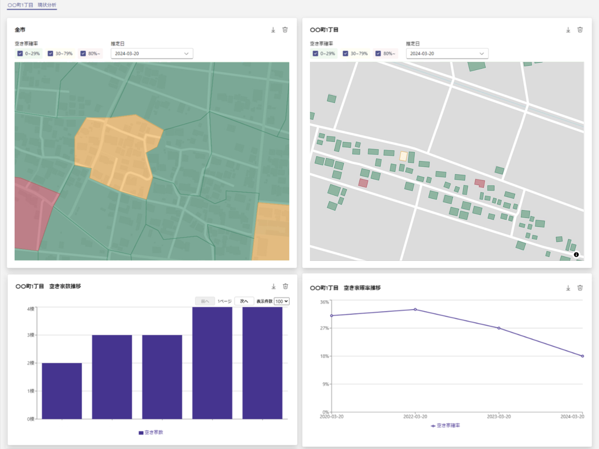

# LINKS SOMA 空き家推定システム
 
 
＊＊目次とアンカーリンクつけてください＊＊
 
 
## 1. 概要

国土交通省が推進する[Project LINKS](https://www.mlit.go.jp/links/)の一環として開発された「LINKS SOMA 空き家推定システム」のソースコードを公開しています。 
本システムは、住民基本台帳やPLATEAU データ、水道情報など自治体が保有する既存データを活用し、地域ごとに最適化した空き家推定AIモデルを用いて、建物が空き家と思われる確率を推定するデスクトップアプリケーションです。 

- 地域の空き家確率を推定
  空き家調査結果等を教師データにし、各自治体の保有データをもとに「その建物が空き家である確率」を推定します。

- 可視化ダッシュボードによる分析
  推定結果を地図やグラフでわかりやすく表示し、重点調査エリアの選定や施策の検討をサポートします。

- ノーコードで操作可能
  GUI操作のみで利用できるため、プログラミングに不慣れな方でも導入しやすい設計です。行政PCで利用できます。



## 2. 利用手順

本システムの利用手順は、[操作マニュアル](./docs/LINKS_SOMA_空き家推定システムマニュアル.pdf)をご参照ください。

## 3. 主な機能

- **名寄せ処理** 
  - 住民基本台帳、水道開閉栓状況・使用量、登記情報、PLATEAU（または家屋現況図）などを自動処理し、ひとつのデータに統合

- **AI モデル構築**

  - 地域の空き家調査結果を教師データとして学習し、空き家判定モデルを自動生成
  - 正解率・F値などの評価指標を自動計算し、精度を把握

- **空き家確率の推定**

  - 構築した AI モデルを用い、推定したい時点のデータから建物ごとに空き家確率を推定
  - 国勢調査の小地域単位や独自のポリゴン単位で集計・可視化
  - 構築した AI モデルを用い、推定したい時点のデータから建物ごとに空き家推定確率を算出

- **可視化ダッシュボードによる分析**
  - 地図表示による地域空き家の可視化
  - 棒グラフによる空き家推定確率の比較（町丁単位などにおける空き家件数の比較など）
  - 円グラフによる空き家推定確率の分布（立物総件数に対する空き家件数の割合を分析するなど）
  - 折れ線グラフによる空き家推定確率の推移（空き家件数の対象年度ごとの推移を分析するなど）
  - 表による空き家推定確率及び関連する属性の表示
  - フィルターによる条件選択
  - 座標系やデータフォーマットを指定しての判定結果のエクスポートなど

## 4. 動作環境

- OS: Windows 10 (64bit) 以上
- CPU: Intel Core i3 第10世代以上（または同等性能）
- メモリ: 8GB 以上（16GB 以上を推奨）
- GPU: Intel UHD Graphics（または同等性能）
- ストレージ: 30GB 以上の空き容量
- その他:
  - .exe ファイルを実行可能な環境（グループポリシーやセキュリティソフトの制限に注意）
  - WebView2 Runtime（Microsoft 製、Windows 11 以降は標準搭載）がインストールされていること
  - LGWAN 等、オフライン環境での運用を想定していますが、ジオコーディング等の一部機能ではインターネット接続が必要な場合があります。

詳細な推奨環境や動作制限は、操作マニュアルに記載しています。

## 5. インストールとセットアップ

こちらの[Releaseページ](https://github.com/Project-LINKS-mlitoss/LINKS-SOMA/releases)から、最新のリリースバージョンをダウンロードしてください。アプリケーションは日本の北海道、東北、関東、中部、近畿、中国、四国、九州の8エリアごとに別れています。該当するエリアのZipファイルをダウンロードしてください。Zipファイルを解凍すると、「LINKS SOMA 空き家推定システム」の実行ファイルが確認できます。ダブルクリックして実行します。
Windows エクスプローラ等で .exe ファイル（システム本体、CityGML Converter、ジオコーディングツールなど）を実行します。
初回実行時にセキュリティソフトによる実行許可を求められる場合があります。自治体の情報システム部門の指示に従ってください。

## 6. データ準備

本システムを活用するには、以下の主なデータが必要です。詳細はマニュアル「2. インプットデータの作成方法」をご参照ください。

- 空き家調査結果（教師データ）
  過去に実施した空き家実態調査などの結果（住所情報が必要）
- 住民基本台帳

住所、世帯番号、生年月日、性別、住定年月日などを含む

- 水道開閉栓状況・使用量

家屋単位の水道番号、開栓・閉栓フラグ、水道使用量、検針年月日など

- 建物ポリゴン

PLATEAU の CityGML → CityGML Converter で gpkg に変換
または家屋現況図（Shapefile 形式やジオパッケージ）

- 国勢調査（小地域境界データ）

地域集計の最小単位として活用

- 任意で利用可能な追加データ

- 建物情報（登記簿、固定資産台帳など）
- 地域集計用ポリゴン（自治体独自の地区、学区など）
- ジオコーディング済みデータ（住所と緯度経度の対応）

## 7. 関連ツール

- LINKS SOMA CityGML Converter
  PLATEAU の CityGML データをジオパッケージ（gpkg）に変換するためのツール。
- ジオコーディングツール
  住所データに対し、AWS などのジオコーディングサービスを用いて緯度・経度を一括で付与するツール。

## 8. ディレクトリ構成

```
LINKS-SOMA/
├── citygml*converter/
│ └── (CityGMLコンバータ関連のソースや実行ファイル)
├── geocoding_tool/
│ └── (ジオコーディングツール関連のソースや実行ファイル)
├── src/
│ └── (本システムのソースコード)
├── docs/
│ ├── 【公開版】LINKS_SOMA*空き家推定システムマニュアル.pdf
│ └── (その他のドキュメント)
├── examples/
│ └── data/
│   └── (サンプルデータ)
│ └── models/
│   └── (学習済みモデルデータ)
├── LICENSE
└── README.md
```

## 9. ライセンス

ソースコード及び関連ドキュメントの著作権は国土交通省に帰属します。
本ドキュメントはProject LINKSサイトポリシー（CCBY4.0及び政府標準利用規約2.0）に従い提供されています。

## 10. 注意事項

- 個人情報保護
  本システムでは住民基本台帳など個人情報を取り扱う場合があります。必ず自治体のセキュリティポリシーや関連法令を遵守し、適切な管理を行ってください。
- 動作保証
  本システムは Windows 10 / 11 環境での動作を想定しており、仮想環境やリモートデスクトップ環境などでは動作を保証していません。
- 免責事項
  本システムの利用や利用不能から生じるいかなる損害に対しても、開発者および国土交通省は一切の責任を負いません。

## 11. お問い合わせ

バグ報告や質問、機能要望などがございましたら、Issues へ起票いただくか、以下の連絡先までご連絡ください。

- 本システムのアプリケーションの活用にあたってのご相談
  株式会社ユーカリヤ(<info@eukarya.io>)
- 本システムの AI（空き家推定）技術についてのご相談
  マイクロベース株式会社(<contact@microgeo.biz>)
